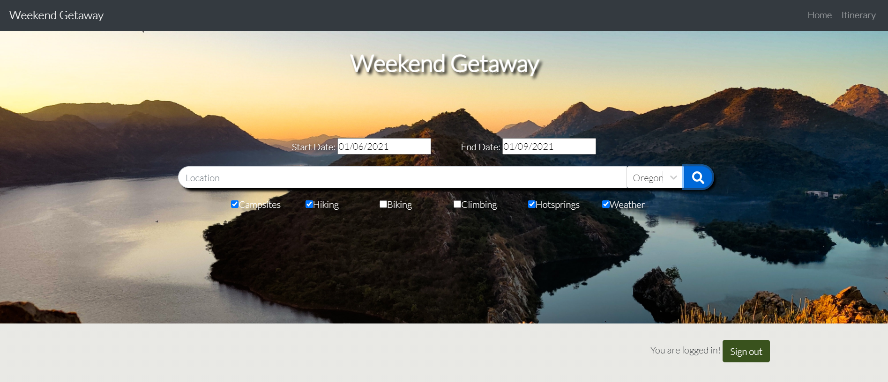
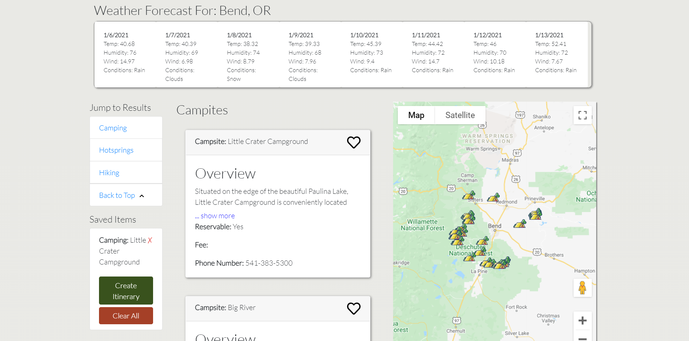
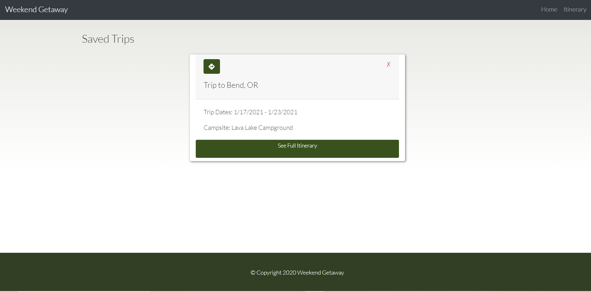
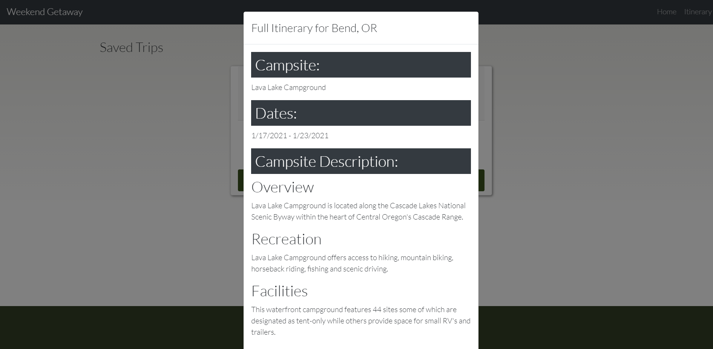
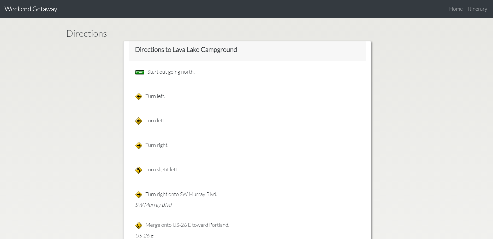

# Weekend Getaway

## Links 

Deployed Application: https://murmuring-citadel-70969.herokuapp.com/

Github Repository: https://github.com/suganyasomu/WeekendGetAway

## Table of Contents
- [Links](#Links)
- [Installation](#Installation)
- [Description](#Description)
- [Technologies](#Technologies)
- [Example](#Example)
- [License](#License)
- [Contribution](#Contribution)
- [Questions](#Questions)

## Installation
`npm install`
    
## Description
This app allows the user to find campsites and activities nearby based on the city they search. The user is able to filter by which activities (camping, hiking, biking, rock climbing, and hotsprings) they want to view, as well as view the current weather forecast of the selected location if they desire. The user can create an account, and once logged in they are able to save the different campgrounds and activities and create an itinerary. The user can view all of their saved itineraries and get directions to the campground from their current location. This application utilizes ReactJS, Bootstrap, MongoDB, and Firebase.  

## Technologies
- JavaScript
- React JS
- React Bootstrap/Spring 
- IndexedDB
- Node JS
- Express JS
- MongoDB
- Firebase
- APIs:
    - Recreation.gov: https://ridb.recreation.gov/download 
    - Hiking Project: https://www.hikingproject.com/ 
    - MTB Project: https://www.mtbproject.com/ 
    - OpenWeatherMap: https://openweathermap.org/ 
    - MapQuest: https://developer.mapquest.com/ 
    - Google Maps: https://developers.google.com/maps/documentation  
    - NOAA Hot Springs Data: Excel sheet (Database Mongo) 

## Example

## License
This application is covered under MIT.
    
## Contributing
Mia de Haan, Kalen Pegeder, Megan Sleezer, & Suganya Somu
    
## Questions
If you have any questions, please contact...
